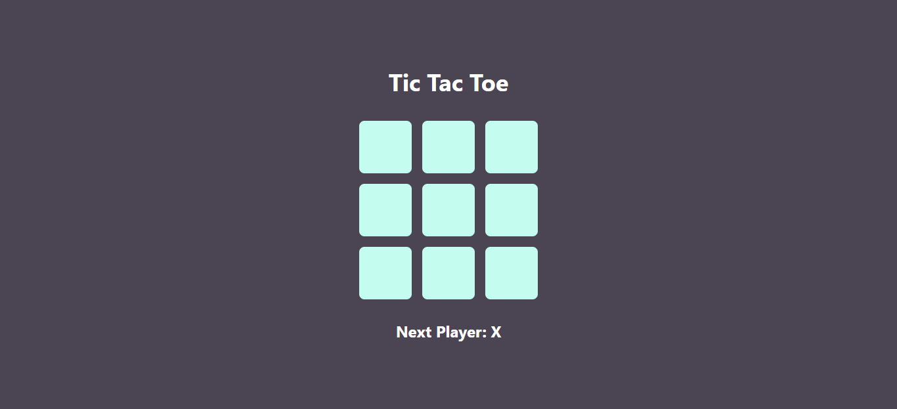

# Tic-Tac-Toe Game

## Welcome! 👋

Thanks for checking out this front-end coding project.

This project is a **Tic-Tac-Toe Game** with a simple, clean UI and intuitive game logic. It’s fully responsive and optimized for various devices.

## Table of Contents

- [Overview](#overview)
- [Features](#features)
- [Technologies Used](#technologies-used)
- [Usage](#usage)
- [Attributions](#attributions)
- [Additional Resources](#additional-resources)

## Overview

The Tic-Tac-Toe Game includes:

- A classic 3x3 game grid where players alternate between "X" and "O."
- Real-time updates for the current player and game outcome.
- A reset option to start a new game without reloading.

## Features

- **Responsive Design:** Playable on mobile, tablet, and desktop.
- **Game Logic:** Clear conditions for win, loss, and draw.
- **Reset Button:** Restart the game easily.

## Technologies Used

- **HTML5**
- **CSS3**
- **JavaScript (React)**

## Attributions

Design crafted with care by **Md. Rakibur Rahman** ✨🎨🚀

- [GitHub](https://github.com/rakiburrahman307)
- [LinkedIn](https://www.linkedin.com/in/md-rakibur-rahman-14b33a2a4/)
- [Email Me](mailto:rakiburrahman307@gmail.com)
- [Live Demo](https://product-list-with-cart-challange.netlify.app/)
## Additional Resources

Happy Coding! 🚀
